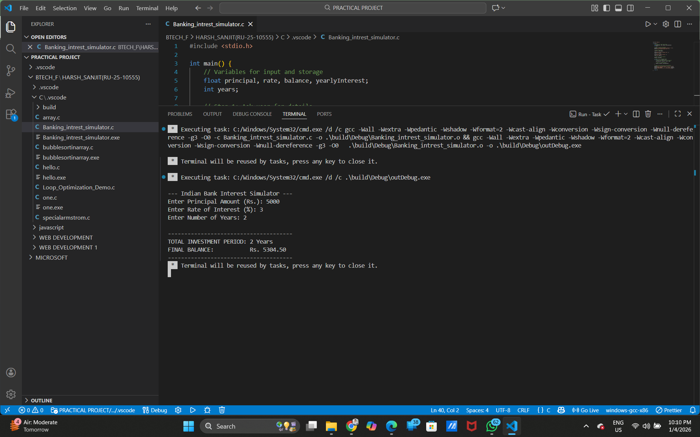

# Programming-Fundamentals-With-C-C-language
PFC(Programming Fundamentals With C.) This is college related Mini Project.
# Banking Interest Simulator (C-Language)

## 📌 Project Overview
The **Banking Interest Simulator** is a console-based application built in C. It calculates the final balance of an investment by applying a yearly interest rate to a principal amount over a specified duration. The project follows the logic of annual compounding, where interest earned is reinvested each year.

## 🚀 Why This Project?
I developed this project to:
* Strengthen my understanding of **iterative loops** and **arithmetic operations** in C.
* Bridge the gap between mathematical formulas and programming logic.
* Create a reusable tool for basic financial planning.

## 🛠️ Built With
* **Language:** C
* **Editor:** VS Code
* **Version Control:** Git & GitHub

## 💡 Utility & Features
* **User-Centric:** Accepts dynamic inputs for Principal, Rate, and Time.
* **Compounding Logic:** Automatically updates the balance every year (Compound Interest).
* **Financial Accuracy:** Provides results in **Indian Rupees (Rs.)** with two-decimal precision.
* **Educational:** Helps users understand the long-term impact of interest rates.

## 🔮 Future Scope
* **Compounding Frequency:** Adding options for Monthly, Quarterly, and Half-yearly compounding.
* **Tax Calculator:** Incorporating TDS (Tax Deducted at Source) calculations.
* **Data Persistence:** Saving calculation history to a `.txt` file.
* **Web Integration:** Converting the logic into a web-based UI using WebAssembly.

## 🖥️ Project Logic (Step-by-Step)
1.  **Input:** Ask for Principal, Rate, and Years.
2.  **Initialize:** Set the initial balance equal to the principal.
3.  **Process:** Run a `for` loop for the total number of years.
4.  **Calculate:** In each iteration, find the interest (`Balance * Rate / 100`) and add it to the `Balance`.
5.  **Output:** Display the final accumulated balance.

## 📸 Output Screenshot

---
**Developed by [Harsh Sanjit]**
---
*Developed as part of a C Programming exercise.*
